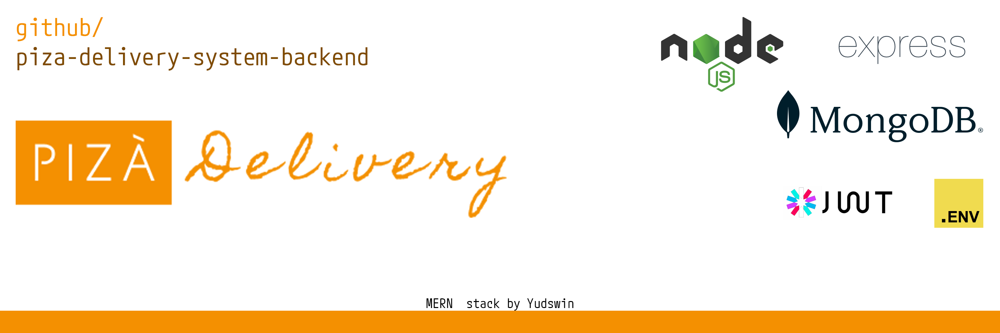

<p align="center">
  <a href="#">  </a>
</p>

# PiZà Delivery System Backend


## 🎇 Description

This project is a food ordering system built with JavaScript. It includes features for managing food items, placing orders, and user authentication.

## ⚒️ Installation

To install the project, follow these steps:

1. Clone the repository
2. Run `npm install` to install the dependencies

## 🎆 Prerequisites

Before you begin, ensure you have met the following requirements:

* You have installed the latest version of [Node.js and npm](https://nodejs.org/en/download/).
* You have installed the following npm packages:

```bash
bcrypt@5.1.1
body-parser@1.20.2
cookie-parser@1.4.6
cors@2.8.5
dotenv@16.3.1
express@4.18.2
jsonwebtoken@9.0.2
mongoose@8.0.3
nodemailer-plugin-inline-base64@2.1.1
nodemailer@6.9.7
nodemon@3.0.2
```

## 🏗️ Structure

The project has the following structure:

- `controllers/`: Contains the logic for handling requests and responses.
- `middleware/`: Contains middleware functions for tasks like authentication.
- `models/`: Contains the data models for the application.
- `routes/`: Defines the application's routes.
- `services/`: Contains services for tasks like sending emails and handling JWTs.

## ▶️ Usage

To start the server, run `npm start`.

The backend for this project can be found at [PiZà Delivery System Frontend](https://github.com/yudswin/piza-delivery-system-frontend).

## 🍕 Contributing

If you want to contribute to this project, please open an issue or a pull request.
